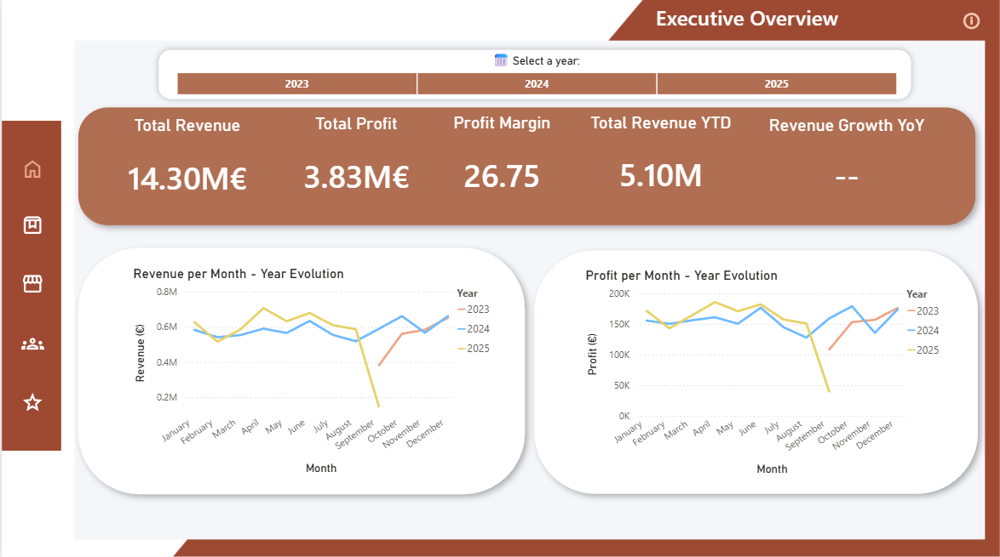
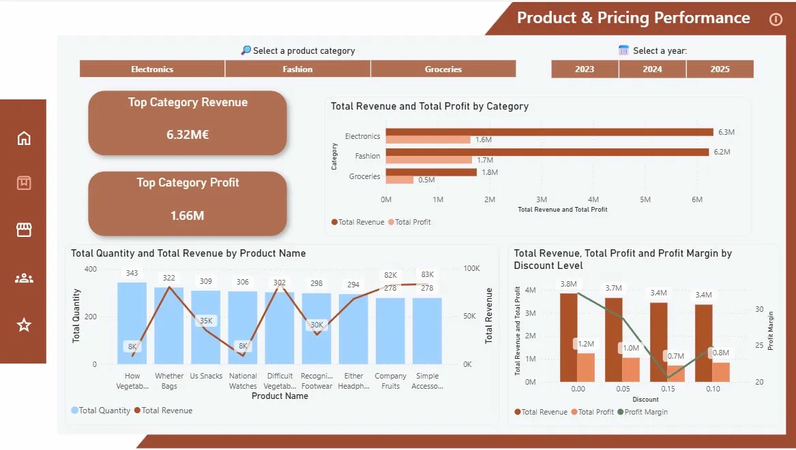
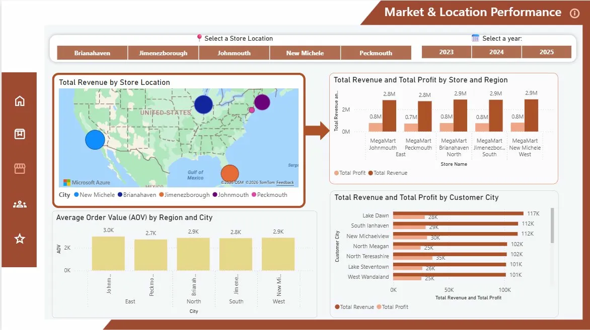
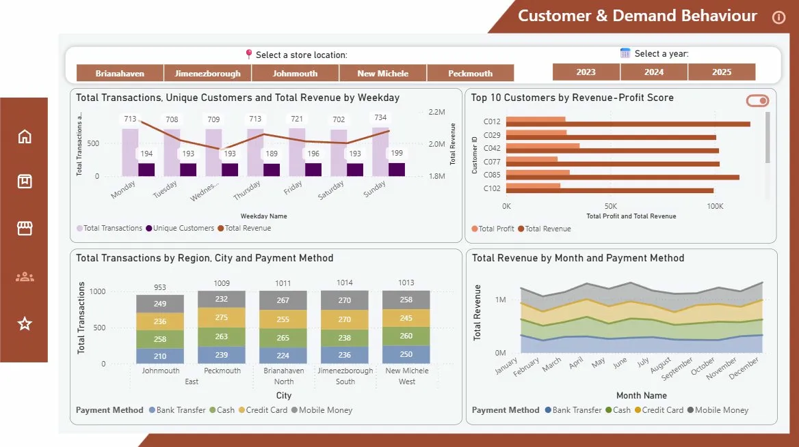
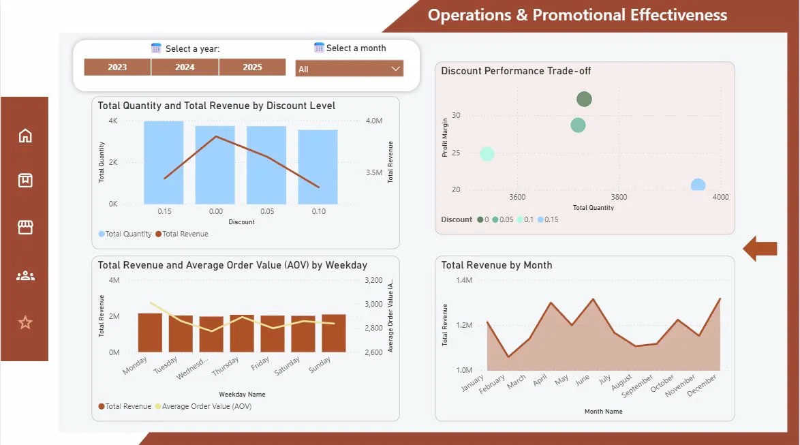
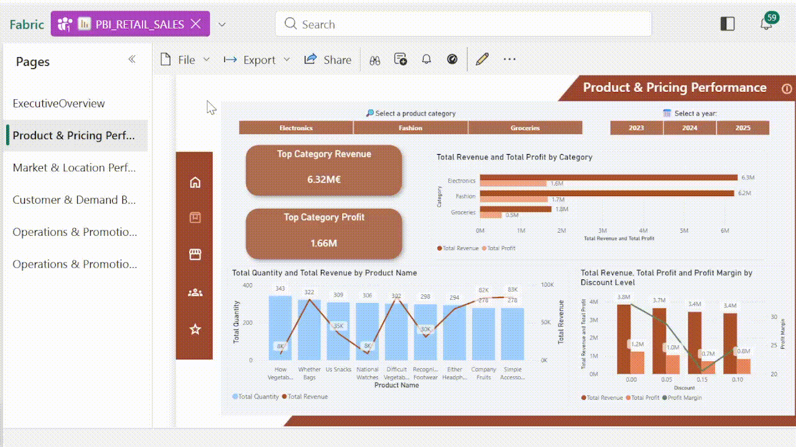
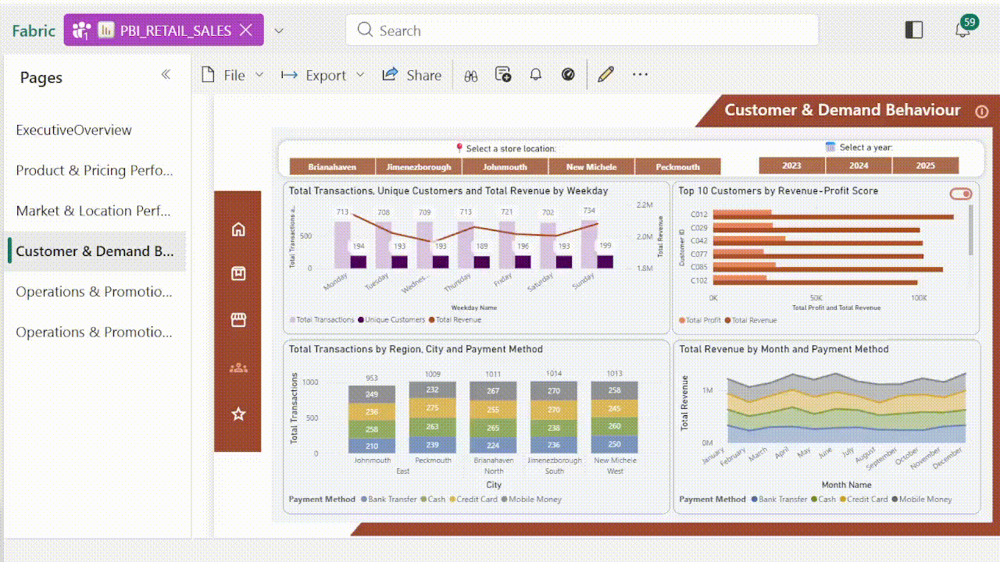
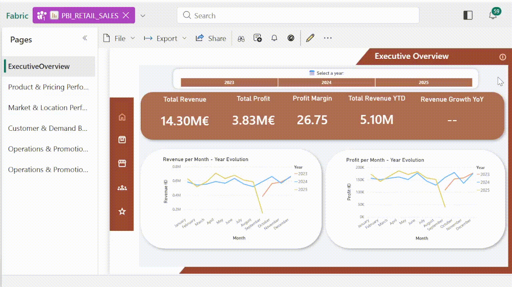

# Retail Sales Analytics — Power BI Dashboard

> Business Intelligence solution built on **Microsoft Fabric** and **Power BI** for a regional retail chain operating 5 stores across 4 regions. Covers sales performance, customer behaviour, product profitability and operational efficiency across 2023 - 2025.

👉 [View the interactive dashboard in Power BI](https://app.fabric.microsoft.com/reportEmbed?reportId=1d50a8d7-a80e-49f7-936f-82d41e82cff1&autoAuth=true&ctid=e4bd69ff-e6f7-4c2e-b247-41b54ba2490e)

---

## Project Structure

```
assets/
├── dashboards/
│   ├── 01_executive_overview.png
│   ├── 02_product_pricing.png
│   ├── 03_market_location.png
│   ├── 04_customer_demand.png
│   ├── 05_operations_discounts.png
│   └── 06_operations_promotions.png
└── gifs/
    ├── year_filter_demo.gif
    ├── category_filter_demo.gif
    ├── customer_toggle_demo.gif
    └── info_bookmark_demo.gif
```

---

## Dashboard Pages

| # | Page | Key Questions Answered |
|---|------|----------------------|
| 1 | [Executive Overview](#1-executive-overview) | What is our overall financial performance and how has it evolved? |
| 2 | [Product & Pricing Performance](#2-product--pricing-performance) | Which products and categories drive revenue and profit? |
| 3 | [Market & Location Performance](#3-market--location-performance) | Which regions and stores are our top performers? |
| 4 | [Customer & Demand Behaviour](#4-customer--demand-behaviour) | Who are our best customers and when do they buy? |
| 5 | [Operations & Promotional Effectiveness](#5-operations--promotional-effectiveness) | How effective are our discounts and promotions? |

---

## 1. Executive Overview

Provides senior management with a high-level snapshot of financial health. Five KPI cards display **Total Revenue**, **Total Profit**, **Profit Margin**, **Revenue YTD** and **YoY Revenue Growth**. Two line charts below track revenue and profit month by month, with separate lines for 2023, 2024 and 2025, allowing direct year-over-year comparison of seasonal patterns and trend deviations.



---

## 2. Product & Pricing Performance

Analyses which product categories and individual products contribute most to revenue, profit and sales volume and evaluates how discounting affects profitability. Includes a **category revenue/profit bar chart**, a **top 10 products chart** combining units sold and revenue and a **discount-level profitability chart** showing how margins shift across different discount tiers. Two page-level KPIs highlight the top category by revenue and profit.



---

## 3. Market & Location Performance

Evaluates performance geographically across regions, stores and customer cities. A **map visual** plots each store sized by total revenue. A **clustered column chart** compares revenue and profit by store and region. An **AOV chart** shows average order value per location and a **customer city bar chart** identifies the top-contributing cities by revenue and profit.

> Note: The original dataset used fictional city names. A supplementary location table with real U.S. coordinates was created to enable the map visual.



---

## 4. Customer & Demand Behaviour

Examines when customers buy, how they pay, and which customers generate the most value. A **weekday activity chart** combines transaction count, unique customers and revenue by day of week. A **top 10 customers bar chart** ranks customers by a composite revenue + profit score, with an interactive toggle to switch to a detailed table view. A **stacked column chart** shows transaction counts by payment method per city and a **stacked area chart** tracks revenue by payment method over time.



---

## 5. Operations & Promotional Effectiveness

Split across two pages, this section analyses discount strategy and temporal demand patterns.

**Page 1 — Discount Overview:** Three KPI cards show Discounted Revenue, Non-Discounted Revenue and Discounted Revenue Share (%). A **donut chart** visualises the revenue split and a **dual-line chart** tracks both revenue streams month by month.


**Page 2 — Discount Performance & Demand Patterns:** A **scatter chart** plots each discount level by total quantity sold vs. profit margin (bubble size = revenue), revealing the volume-profitability trade-off. A **line and column chart** compares quantity and revenue across discount tiers. A **weekly demand chart** shows revenue and average order value by weekday and a **monthly area chart** reveals seasonal sales patterns.



---

## Interactive Features

### Year & Store Filters
Each page includes button-style slicers for year (2023/ 2024/ 2025) and store location. Selecting different combinations updates all KPIs, charts and the map simultaneously.


---

### Category Filter
The Product & Pricing page includes a category slicer for Electronics, Fashion and Groceries. 
Selecting a category updates the KPI cards, the revenue/profit bar chart, the top products chart and the discount-level chart simultaneously.



---

### Customer Table Toggle
The Top 10 Customers visual on the Customer & Demand page includes an interactive toggle that switches between a bar chart view and a detailed table showing Customer ID, tenure in years and total revenue.



---

### Page Info Bookmarks
Each page title includes an info icon (ℹ️). Clicking it triggers a bookmark that overlays a brief description of the page's purpose and analytical focus, then dismisses on click.



---

## Semantic Model

Built as a **star schema** in Microsoft Fabric with the Transactions table as the fact table and four dimension tables: Customers, Products, Stores, and a custom Date dimension spanning 2020–2025.

**15 DAX measures** were developed, including:

| Measure | Purpose |
|---------|---------|
| `Total Revenue` | Core revenue metric: quantity × unit price × (1 − discount) |
| `Total Profit` | Revenue minus total cost of goods sold |
| `Profit Margin` | Profit as a percentage of revenue |
| `Average Order Value (AOV)` | Revenue ÷ total transactions |
| `Total Revenue YTD` | Cumulative revenue from start of year |
| `YoY Revenue %` | Year-over-year revenue growth percentage |
| `Top Customer Score` | Ranks customers by 50% revenue + 50% profit |
| `Top Product Score` | Ranks products by 50% quantity + 50% revenue |
| `Discounted Revenue` | Revenue from transactions with a discount applied |
| `Discounted Revenue Share (%)` | Discounted revenue as a share of total revenue |
| `IsTopCity` | Flags cities in the top 10 by revenue or profit |

---

## Technical Stack

- **Microsoft Fabric** — Lakehouse for data storage and transformation
- **Power BI** — Semantic model and interactive reports
- **DAX** — All business logic and KPIs defined as measures in the semantic layer

---

## Authors

| Student ID | Name |
|------------|------|
| 20241646 | Carla Ferreira |
| 20241147 | Cristiana Varela |
| 20241137 | Gonçalo Bento |
| 20241598 | Sofia Salvado |

*Nova IMS — Analyzing and Visualizing Data, January 2026*